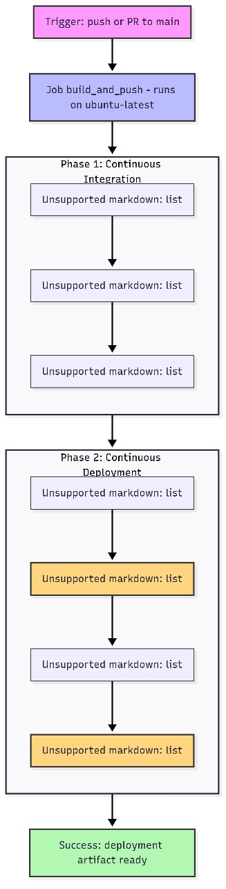
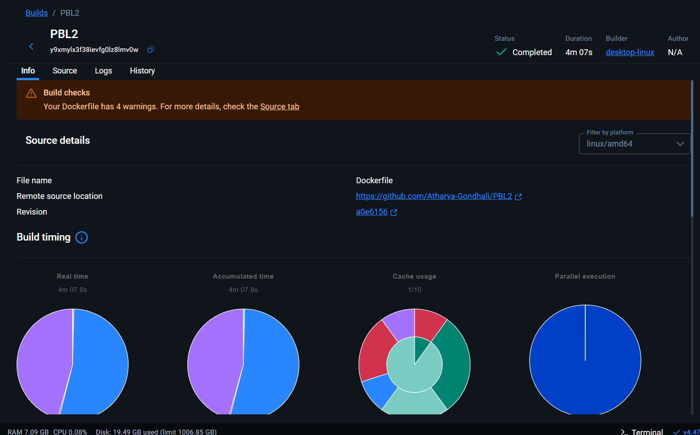
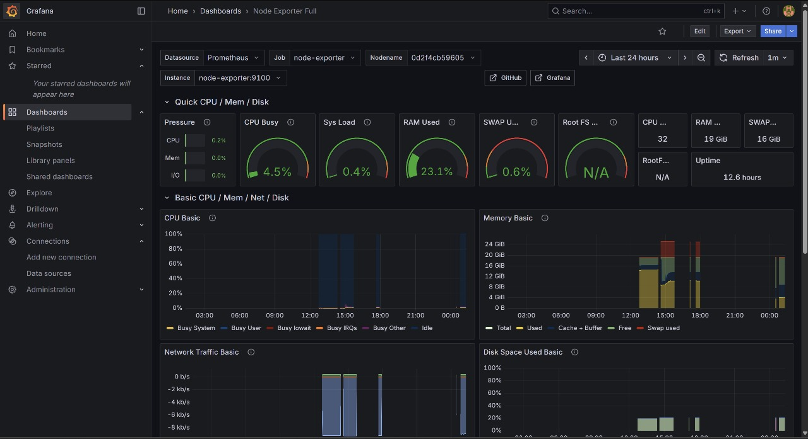
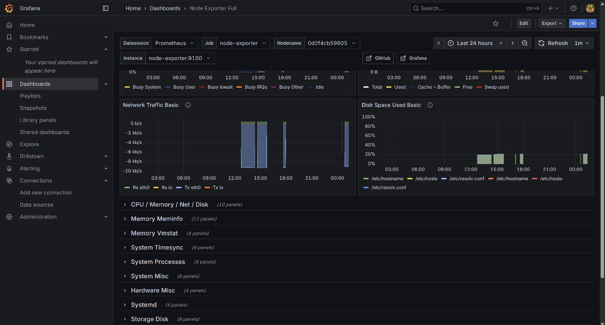
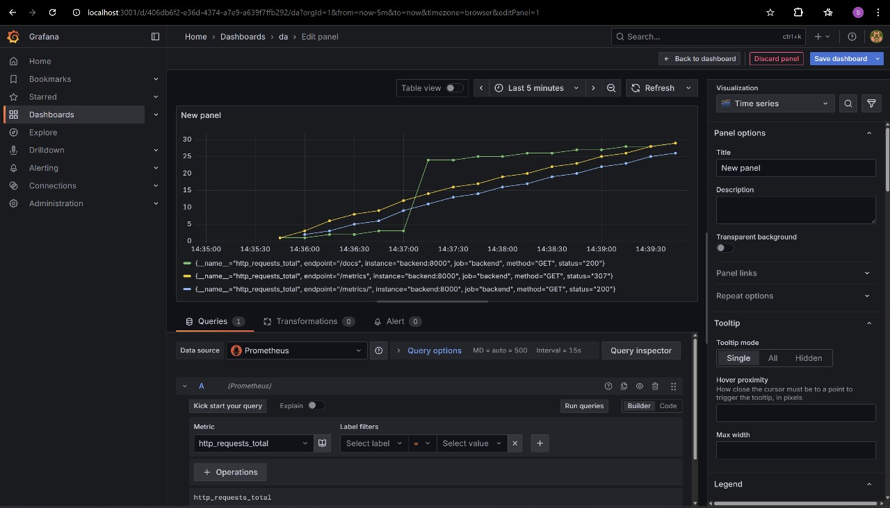
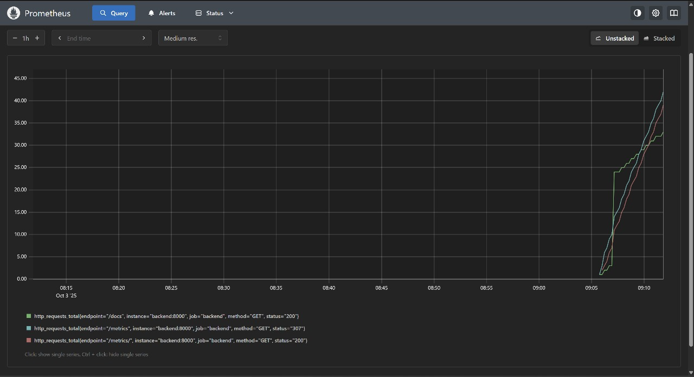

# Deepfake Detection — Complete CI/CD Documentation

## Overview
The **Deepfake Detection App** is an AI system for detecting manipulated (deepfake) audiofiles.  
This project implements a **full DevOps CI/CD pipeline** using:
- **GitHub Actions** (automation)
- **Docker** (containerization)
- **Kubernetes** (orchestration)
- **Ansible** (configuration management)
- **Prometheus & Grafana** (monitoring and visualization)

---

## Architecture Overview

### Components
- **GitHub Actions** - Automates build, test, and deployment workflows.
- **Docker** - Packages app and dependencies into a consistent image. 
- **Kubernetes** - Manages container deployments and rollouts. 
- **Ansible** - Configures and provisions target servers. 
- **Grafana** - Provides monitoring and visualization. 

### Flow
1. Developer pushes code to GitHub → triggers workflow.
2. CI/CD pipeline builds and pushes Docker image → Docker Hub.
3. Kubernetes automatically pulls the latest image.
4. Prometheus collects metrics → Grafana visualizes data.


---

## CI/CD Workflow (GitHub Actions)

### Trigger
Triggered on **push** or **pull request** to the `main` branch.

### Workflow Steps
1. **Checkout Repository**
   ```yaml
   - name: Checkout code
     uses: actions/checkout@v4
   ```
2. **Setup Python**
   ```yaml
   - name: Set up Python 3.9
     uses: actions/setup-python@v5
     with:
       python-version: '3.9'
   ```
3. **Code Validation**
   ```bash
   python -m compileall .
   ```
4. **Build and Push Docker Image**
   ```yaml
   - name: Build and Push Docker Image
     uses: docker/build-push-action@v5
     with:
       context: .
       push: true
       tags: ${{ secrets.DOCKER_USERNAME }}/deepfake-detection-app:latest
   ```

---

## Docker Setup

### Dockerfile
```dockerfile
FROM python:3.9-slim
WORKDIR /usr/src/app
COPY requirements.txt .
RUN pip install --no-cache-dir -r requirements.txt
COPY . .
EXPOSE 5000
CMD ["python", "app.py"]
```


---

## Monitoring Setup

### Prometheus Query Example
```promql
http_requests_total{job="backend", method="GET"}
```

### Grafana Dashboard
- **CPU, Memory, Disk Usage**
- **Request Trends (http_requests_total)**
- **Pod Health Visualization**





---

## Challenges Faced
- Dockerfile warnings (missing `.dockerignore`, large image size)
- Delayed Kubernetes rollouts due to missing readiness probes
- Initial Prometheus data delays (resolved by generating traffic)
- Secret management with GitHub Secrets and Kubernetes Secrets

---

## Lessons Learned
1. Automate all steps (CI/CD, provisioning).
2. Use multi-stage Docker builds to reduce image size.
3. Implement readiness & liveness probes early.
4. Protect credentials via secret management.
5. Monitor continuously with Prometheus & Grafana.

---

## Future Improvements
- Integrate Helm or Kustomize.
- Add automated tests (pytest) before build.
- Configure Prometheus alerts.
- Integrate CI notifications (Slack/Email).
- Use GitOps (ArgoCD) for continuous deployment.


## References
- [GitHub Actions Docs](https://docs.github.com/actions)
- [Docker Buildx](https://docs.docker.com/buildx/)
- [Kubernetes Documentation](https://kubernetes.io/docs/)
- [Prometheus Query Guide](https://prometheus.io/docs/)
- [Grafana Docs](https://grafana.com/docs/)

## GROUP MEMBERS
- [@Atharva-Gondhali](https://github.com/Atharva-Gondhali) - 22070122038
- [@ayushranjan002](https://github.com/ayushranjan002) - 22070122043
- [@trishaboda](https://github.com/trishaboda) – 22070122046
- [@divyansh14kr](https://github.com/divyansh14kr) - 22070122056

## TASK 6 - BONUS (KAGGLE CHALLENGE)
- https://www.kaggle.com/competitions/jigsaw-agile-community-rules/overview

Description: 
Your task is to create a binary classifier that predicts whether a Reddit comment broke a specific rule. The dataset comes from a large collection of moderated comments, with a range of subreddit norms, tones, and community expectations.

The rules you’ll be working with are based on actual subreddit guidelines, but the dataset itself is drawn from older, unlabeled content. A small labeled dev set has been created to help you get started.

This is a chance to explore how machine learning can support real-world content moderation, particularly in communities with unique rules and norms.


