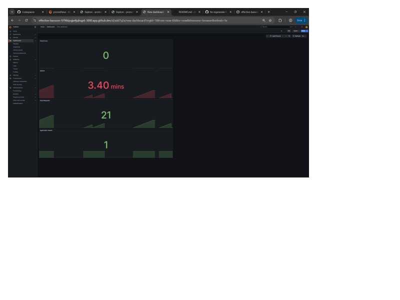
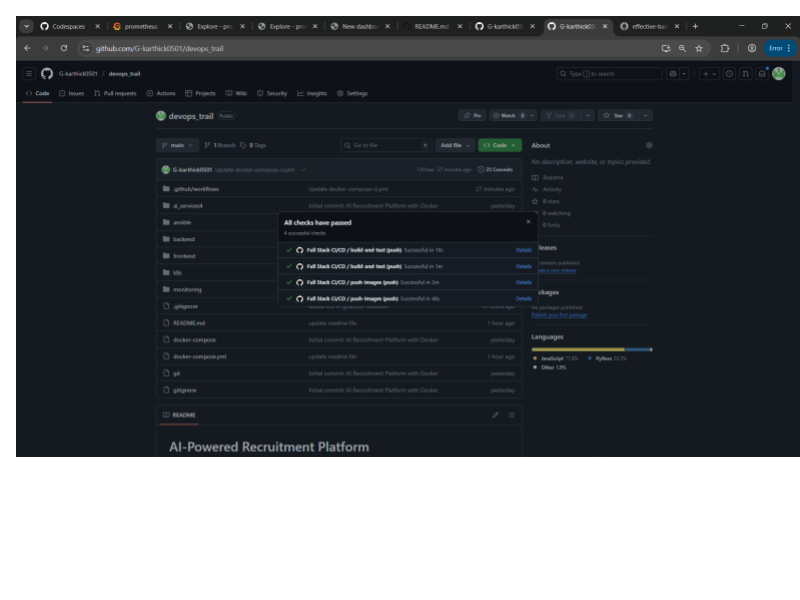
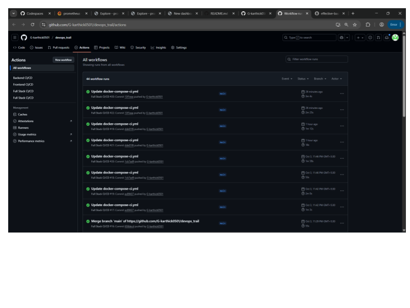
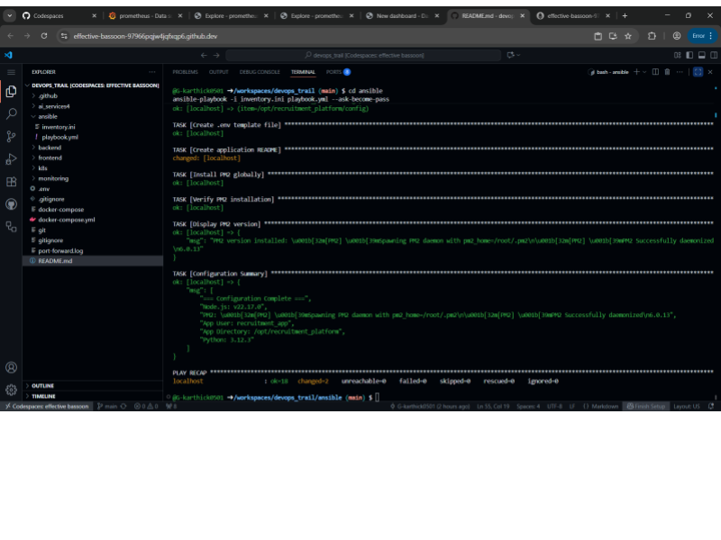
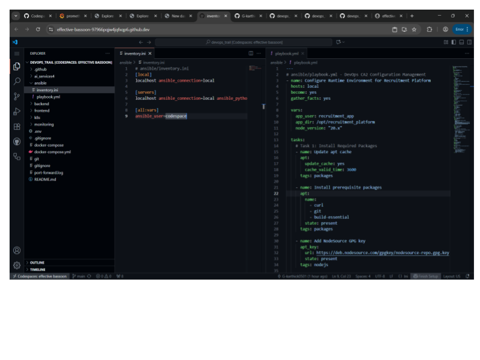
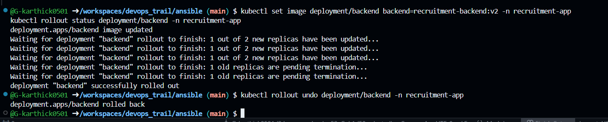
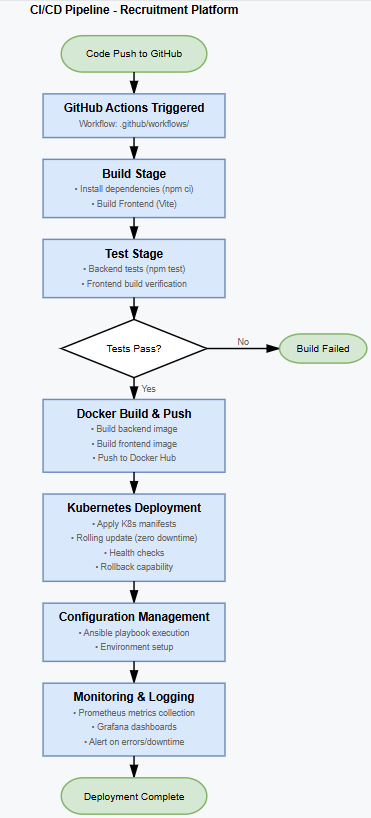

# AI-Powered Recruitment Platform

Full-stack recruitment application demonstrating enterprise DevOps practices: CI/CD automation, container orchestration, infrastructure as code, and real-time monitoring.

## Features

- **Resume Analysis**: AI-powered resume matching against job descriptions
- **Mock Interviews**: Practice interviews with automated feedback
- **Coding Assessments**: Multi-language code execution environment
- **Role-Based Access**: Separate dashboards for candidates, HR, and admins

## Tech Stack

**Application**: React, Node.js, Express, MongoDB  
**DevOps**: GitHub Actions, Docker, Kubernetes, Ansible, Prometheus, Grafana  
**Cloud**: Docker Hub Registry, Minikube

## Quick Start
```bash
# Clone and run
git clone https://github.com/G-karthick0501/devops_trail.git
cd devops_trail
docker-compose up -d

# Access
# Frontend: http://localhost:80
# Backend: http://localhost:5000
# Grafana: http://localhost:3000 (username/password) :: (admin/admin)
# Prometheus: http://localhost:9090

```
## Configuration Management (Ansible)
```
cd ansible
ansible-playbook -i inventory.ini playbook.yml --ask-become-pass
```

## Kubernetes Deployment
```
kubectl apply -f k8s/
kubectl get pods -n recruitment-app
```


## Rolling Update Demo
```
# Update
kubectl set image deployment/backend backend=recruitment-backend:v2 -n recruitment-app
kubectl rollout status deployment/backend -n recruitment-app

# Rollback
kubectl rollout undo deployment/backend -n recruitment-app
```

## Troubleshooting

```
# Check status
docker-compose ps
kubectl get pods -n recruitment-app

# View logs
docker logs recruitment-backend
kubectl logs <pod-name> -n recruitment-app

# Rebuild
docker-compose down -v
docker-compose up -d --build
```

# Project Documentation

---

## Architecture

> "Our system is built as a microservice-oriented full-stack application, centered on a Node.js backend and a React frontend. MongoDB serves as our primary data store, with AI-powered microservices providing advanced analysis. All components are containerized using Docker and orchestrated in Kubernetes for scalability and resilience."

**Key Components:**
- **Frontend**: React SPA, served via Nginx.
- **Backend**: Node.js REST API, exposes business logic and connects to MongoDB.
- **AI Microservices**: Python FastAPI services for resume and interview analysis.
- **Database**: MongoDB running in a Kubernetes pod, persistent via PVC.
- **Monitoring**: Prometheus scrapes metrics from backend, Grafana visualizes uptime, latency, error rates.

> "Each service is described via dedicated Dockerfiles and Kubernetes manifests. Kubernetes handles pod scaling, health checks, rolling updates, and service discovery."

---

## Pipeline Flow

> "Our CI/CD pipeline is powered by GitHub Actions. Every push to the main branch triggers automated builds, tests, and deployments. The pipeline ensures rapid, reliable delivery from code to cloud."

**Pipeline Steps:**
1. **Commit & Push**: Developer pushes code to GitHub.
2. **Build**:  
   ```
   - name: Build backend image
     run: docker build -t myrepo/backend:latest -f backend/Dockerfile backend
   - name: Build frontend image
     run: docker build -t myrepo/frontend:latest -f frontend/Dockerfile frontend
   ```
3. **Test**: Runs npm/unit tests (if present).
4. **Push Images**:  
   ```
   - name: Push backend image
     run: docker push myrepo/backend:latest
   - name: Push frontend image
     run: docker push myrepo/frontend:latest
   ```
5. **Deploy**:  
   ```
   - name: Deploy to Kubernetes
     run: kubectl apply -f k8s/
   ```
6. **Orchestration**: Kubernetes rolls out new pods, using liveness/readiness probes and rolling updates.
7. **Monitoring**: Prometheus scrapes `/metrics` endpoints; Grafana dashboards provide real-time visibility.

---

## Challenges

> "Several hurdles surfaced during our DevOps journey. The most persistent included YAML syntax errors, Docker image caching issues, and OAuth origin mismatches during local development."

**Examples:**
- **YAML Syntax**:  
  > "A missing space or indentation in `k8s/07-backend-deployment.yaml` would halt deployments, sometimes with cryptic errors."
- **Docker Caching**:  
  > "Outdated dependencies persisted due to Docker layer caching. We solved this by using `RUN npm ci` and careful cache busting."
- **OAuth Origin Mismatch**:  
  > "Local testing triggered 400 errors until we registered both `http://localhost` and `http://127.0.0.1` in our OAuth provider."
- **Rolling Update & Rollback**:  
  > "A failed deployment taught us the value of `kubectl rollout undo`. Fast rollback prevented downtime."

---

## Lessons Learned

> "Automating everything—from builds to infra config—saves time and reduces errors. We learned that Infrastructure as Code (IaC) is essential for reproducibility, and that monitoring should be built in from the start, not as an afterthought."

**Takeaways:**
- **CI/CD**:  
  > "Automated pipelines catch errors early and keep deployments consistent."
- **IaC & Config Management**:  
  > "Ansible playbooks let us set up servers in minutes, not hours."
- **Containerization & Orchestration**:  
  > "Docker and Kubernetes make scaling and recovery seamless. Rolling updates and health checks ensure high availability."
- **Monitoring**:  
  > "Prometheus + Grafana dashboards help us spot issues before users do."
- **Documentation**:  
  > "Clear records of architecture, pipeline, and troubleshooting steps speed up onboarding and incident response."

---

## Screenshots

1. **Prometheus + Grafana Dashboard**  


2. **Deployment Strategy - GITHUB Actions**  
  
  

3. **Configuration Management & IaC - Playbook & Inventory**  
  
  

4. **Containerization & Orchestration - Rolling Updates & Rollback**  
  

5. **CI/CD Pipeline Overview**  



# End of Documentation


