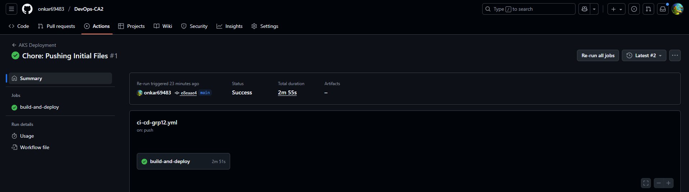
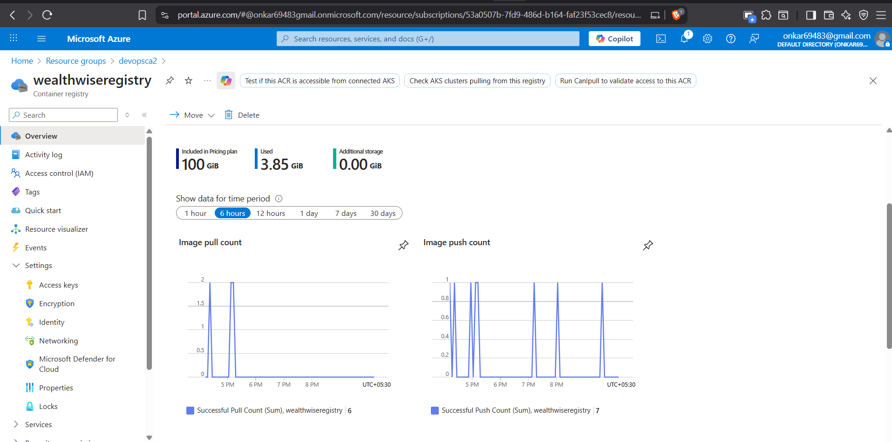
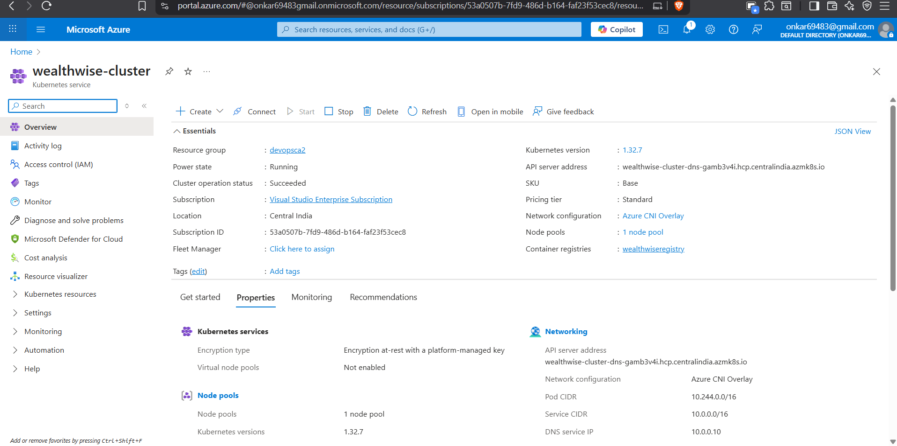
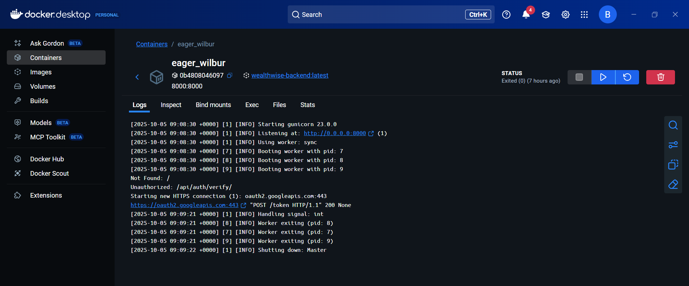
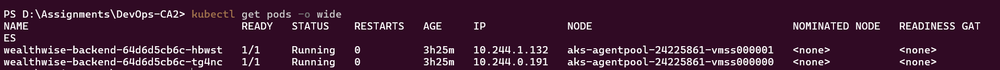
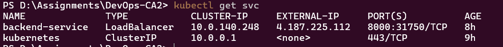
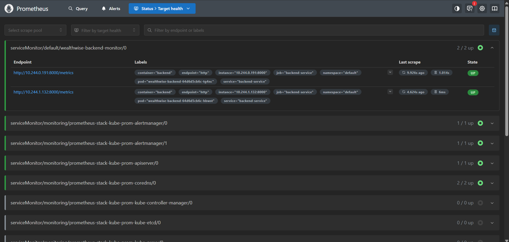
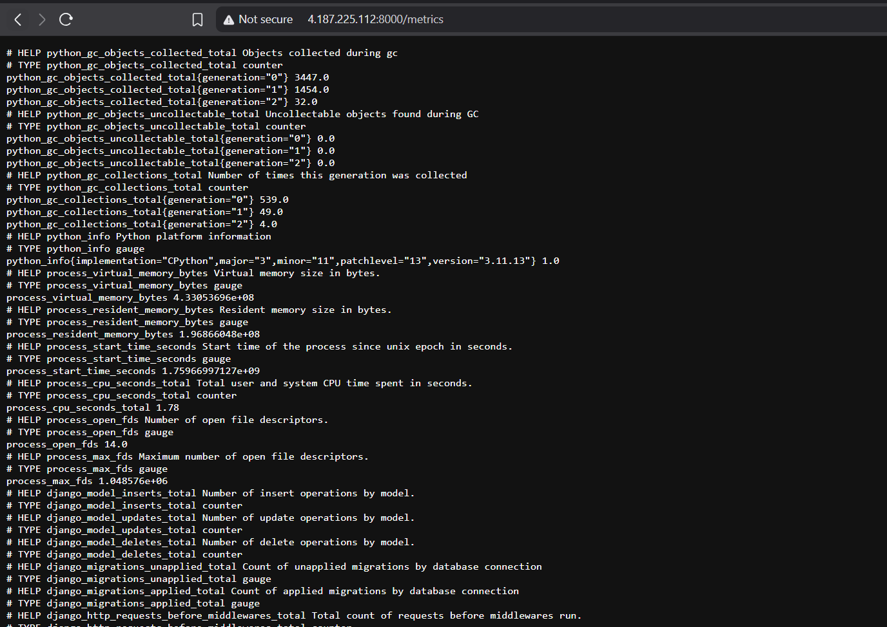
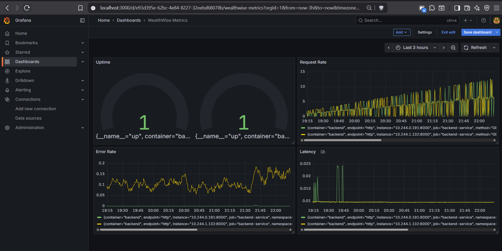
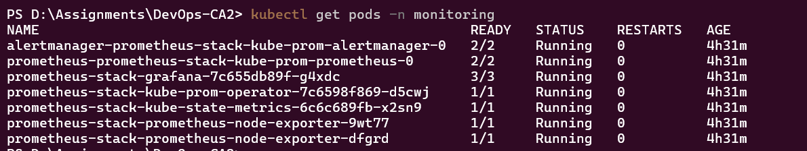

# 📘 DevOps CA2 – Group 12 Documentation

Welcome to the **Group 12 (PRN-086-119-120-135)** documentation!  
This repository documents the complete DevOps lifecycle — from **CI/CD** to **Monitoring** and **Open Source Contributions**.

---

## 🗂️ Documentation Overview

<b>🚀 Step 1: CI/CD Setup</b>

### 🎯 Goal
Implement **Continuous Integration** and **Continuous Deployment** using GitHub Actions.

### 📁 Files
- [`ci-cd-grp12.yml`](./step1-CICD/ci-cd-grp12.yml) – GitHub Actions pipeline workflow.

### 🖼️ Screenshots
- 
- 

### 🧩 Highlights
- Automated build and deploy pipeline.
- Seamless workflow with GitHub Actions.

---

<b>🧠 Step 2: Ansible Automation</b>

### 🎯 Goal
Automate infrastructure setup using **Ansible**.

### 📁 Files
- [`inventory.ini`](./step2-ansible/inventory.ini)
- [`setup-backend.yml`](./step2-ansible/setup-backend.yml)
- [`setup-frontend.yml`](./step2-ansible/setup-frontend.yml)
- [`setup-prediction.yml`](./step2-ansible/setup-prediction.yml)

### 🖼️ Screenshots
- 
- 

### 🧩 Highlights
- Automated provisioning and configuration.
- Environment consistency across deployments.

---

<b>🐳 Step 3: Docker & Kubernetes Deployment</b>

### 🎯 Goal
Containerize the app and deploy on **Azure Kubernetes Service (AKS)**.

### 📁 Files
- [`Dockerfile`](./step3-docker-kubernetes/Dockerfile)
- [`deployment.yaml`](./step3-docker-kubernetes/k8s/deployment.yaml)
- [`service.yaml`](./step3-docker-kubernetes/k8s/service.yaml)
- [`backend-servicemonitor.yaml`](./step3-docker-kubernetes/k8s/backend-servicemonitor.yaml)

### 🖼️ Screenshots
- 
- 
- 
- 
- 

### 🧩 Highlights
- CI/CD integrated with container orchestration.
- Scalable and resilient cloud deployment.

---

<b>📊 Step 4: Monitoring with Grafana & Prometheus</b>

### 🎯 Goal
Integrate **Prometheus** and **Grafana** for system monitoring.

### 📁 Files
- [`backend-servicemonitor.yaml`](./step4-grafana-prometheus/backend-servicemonitor.yaml)

### 🖼️ Screenshots
- 
- 
- 
- 

### 🧩 Highlights
- Metrics-based health visualization.
- Custom Grafana dashboards.

---

<b>📄 Step 5: Final Documentation</b>

### 📁 Files
- [`group12-documentation.pdf`](./step5-documentation/group12-documentation.pdf)

### 🧩 Highlights
- Detailed report covering architecture, workflows, and outcomes.
- Includes evidence and references for each DevOps stage.

---

<b>🌐 Step 6: Bonus – Open Source Contribution</b>

### 🎯 Goal
Demonstrate ethical participation in open-source projects.

### 📁 Files
- [`issue.png`](./step6-bonus-github-opensrc-contri/issue.png)
- [`pr.png`](./step6-bonus-github-opensrc-contri/pr.png)
- [`content_blocked.png`](./step6-bonus-github-opensrc-contri/content_blocked.png)
- [`inappropriate_content.png`](./step6-bonus-github-opensrc-contri/inappropriate_content.png)

### 🧩 Highlights
- Created & resolved issues.
- Submitted valid Pull Requests.
- Reported inappropriate content responsibly.

---

## 📊 Summary Table

| Step | Focus Area | Tools Used |
|------|-------------|------------|
| 1 | CI/CD Pipeline | GitHub Actions |
| 2 | Configuration Management | Ansible |
| 3 | Containerization & Deployment | Docker, Kubernetes (AKS) |
| 4 | Monitoring | Prometheus, Grafana |
| 5 | Documentation | Markdown, PDF |
| 6 | Open Source Contribution | GitHub |

---

## 👨‍💻 Team Members

| PRN | Name |
|-----|------|
| 22070122086 | *Janmejay Pandya* | 
| 22070122119 | *Sachin Mhetre* | 
| 22070122120 | *Mihir Hebalkar* | 
| 22070122135 | *Onkar Mendhapurkar* | 

---

## 🌍 Live Links

- **Frontend (Production):** [https://mufg-wealthwise.vercel.app](https://mufg-wealthwise.vercel.app)  
- **GitHub Repo:** [DevOps-CA2-Group12](https://github.com/onkar69483/Devops-CA2)

---

> 🛡️ **Note:** All API keys, credentials, and secrets have been rotated or redacted for security purposes.

---

✨ *End of Documentation*
